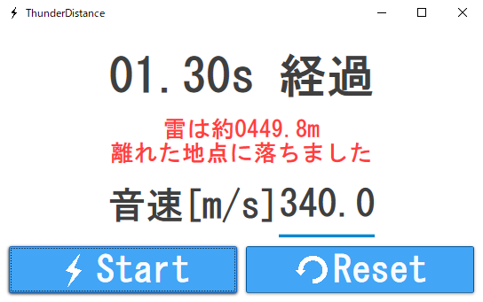
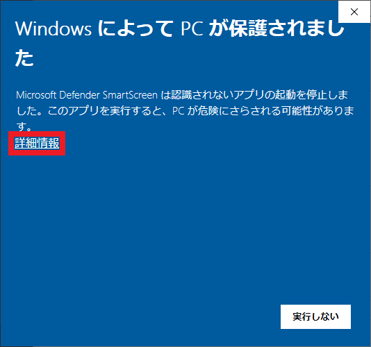
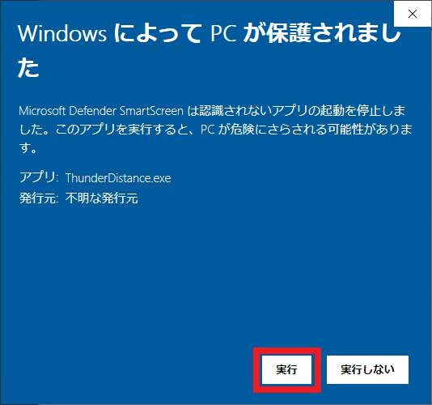

# ThunderDistance

ThunderDistanceは現在地と雷が落ちた地点の距離を推測します．稲妻が見えた時間と雷の音が聞こえた時間差と音速を用いて計算します．

# DEMO

# Requirement
* WindowsOS

# Download
以下のURLからAssets→ThunderDistance.exeをクリック． 
https://github.com/Tsuyopon-1067/ThunderDistance/releases/tag/v1.0
 
起動時に以下のような警告が出ることがありますが，詳細情報をクリック→実行ボタンをクリックで起動できます．

# Author
つよぽん

# attention
このソフトウェアを使用したことによって生じたすべての障害・損害・不具
合等に関しては、私と私の関係者および私の所属するいかなる団体・組織とも、
一切の責任を負いません。
