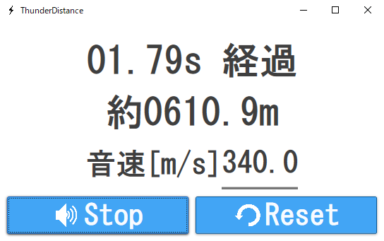

# ThunderDistance

ThunderDistanceは現在地と雷が落ちた地点の距離を推測します．稲妻が見えた時間と雷の音が聞こえた時間差と音速を用いて計算します．

# DEMO

# Requirement
* WindowsOS

# Download
以下のURLからAssets→ThunderDistance.exeをクリック． 
https://github.com/Tsuyopon-1067/ThunderDistance/releases/tag/v1.0

# Author
つよぽん